# User Flow
# WorkFlow - 사용자 행동 흐름 정의

**버전:** 1.0  
**작성일:** 2026-02-02  
**작성자:** UX Team  
**문서 상태:** Draft

---

## 목차

1. [문서 개요](#1-문서-개요)
2. [근로자 User Flow](#2-근로자-user-flow)
3. [관리자 User Flow](#3-관리자-user-flow)
4. [시스템 통합 Flow](#4-시스템-통합-flow)
5. [예외 상황 Flow](#5-예외-상황-flow)

---

## 1. 문서 개요

### 1.1 문서 목적
본 문서는 WorkFlow 시스템의 주요 사용자 행동 흐름을 시각화하여, UX/UI 디자인과 개발 구현의 기준을 제공한다.

### 1.2 User Flow 범위
- 근로자의 출퇴근 체크인/체크아웃
- 관리자의 근태 모니터링 및 급여 처리
- 예외 상황 처리 (GPS 실패, 네트워크 오류 등)

### 1.3 표기 규칙
- 📱 = 모바일 앱 (근로자)
- 💻 = 웹 대시보드 (관리자)
- 🔧 = 시스템 처리
- ❌ = 오류 처리
- ✅ = 성공 처리

---

## 2. 근로자 User Flow

### 2.1 회원가입 및 로그인

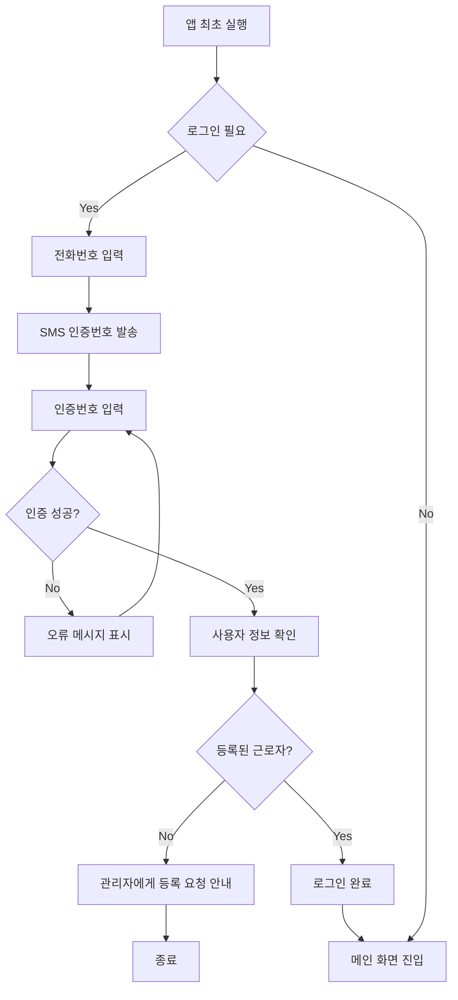

**상세 설명:**

1. **앱 최초 실행**
   - 스플래시 화면 표시 (1초)
   - 로그인 상태 확인

2. **전화번호 입력**
   - 국가 코드 자동 선택 (+82)
   - 숫자만 입력 가능
   - 하이픈 자동 포맷팅

3. **SMS 인증**
   - 6자리 인증번호 발송
   - 유효 시간: 3분
   - 재발송 가능 (1분 후)

4. **사용자 확인**
   - DB에서 전화번호로 근로자 조회
   - 미등록 시 관리자 연락처 안내

---

### 2.2 출근 체크인

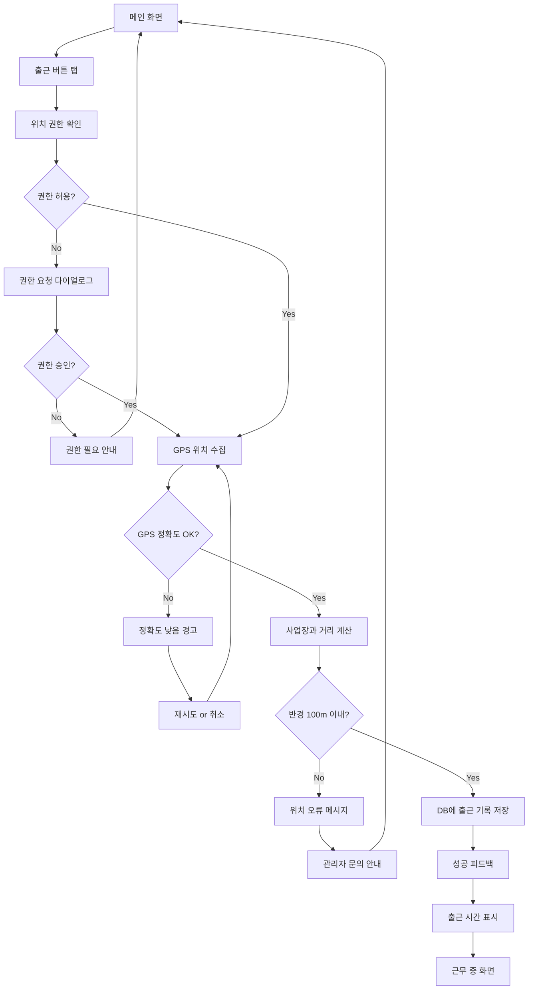

**상세 설명:**

1. **메인 화면 구성**
   - 상단: 사용자 이름, 사업장명
   - 중앙: 큰 "출근" 버튼 (초록색)
   - 하단: 최근 출퇴근 기록

2. **GPS 위치 수집**
   - Geolocator 패키지 사용
   - 정확도 < 50m 요구
   - 타임아웃: 10초

3. **거리 계산**
   - Haversine 공식 사용
   - 사업장 GPS 좌표와 비교
   - 허용 반경: 100m

4. **성공 피드백**
   - 진동 (200ms)
   - "출근이 완료되었습니다 ✓"
   - 출근 시간 표시 (HH:MM:SS)

---

### 2.3 퇴근 체크아웃

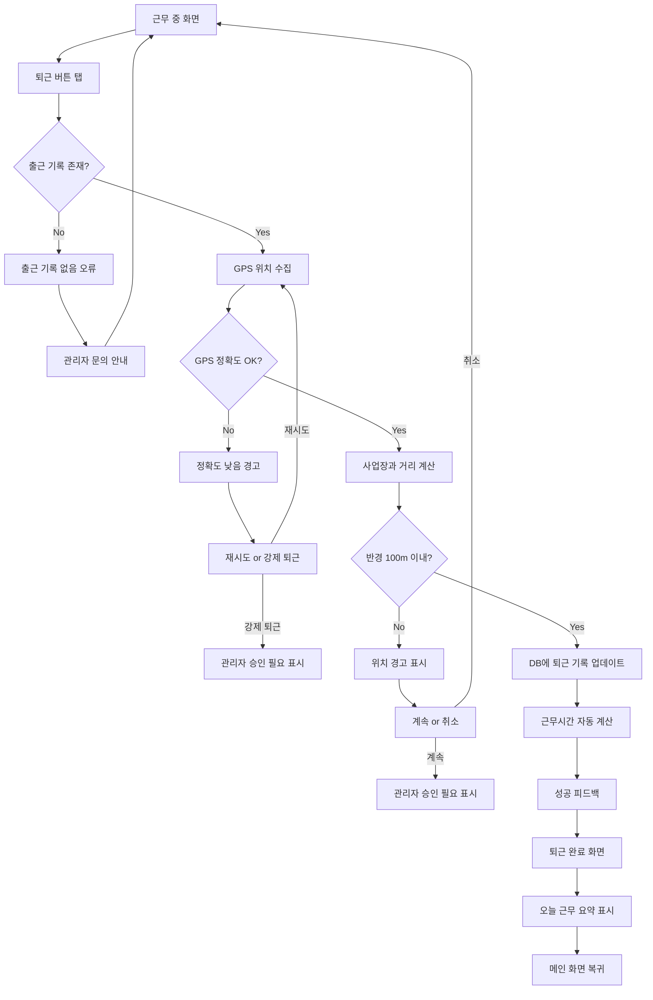

**상세 설명:**

1. **근무 중 화면**
   - 출근 시간 표시
   - 현재 근무 시간 (실시간 카운트)
   - 퇴근 버튼 (파란색)

2. **퇴근 검증**
   - 출근 기록 존재 확인
   - GPS 위치 재수집
   - 거리 재계산

3. **강제 퇴근 옵션**
   - GPS 오류 시 선택 가능
   - 관리자 승인 필요 표시
   - 메모 입력 가능

4. **근무 요약**
   - 출근 시간, 퇴근 시간
   - 총 근무 시간 (HH:MM 형식)
   - (향후) 예상 급여

---

### 2.4 근태 기록 조회

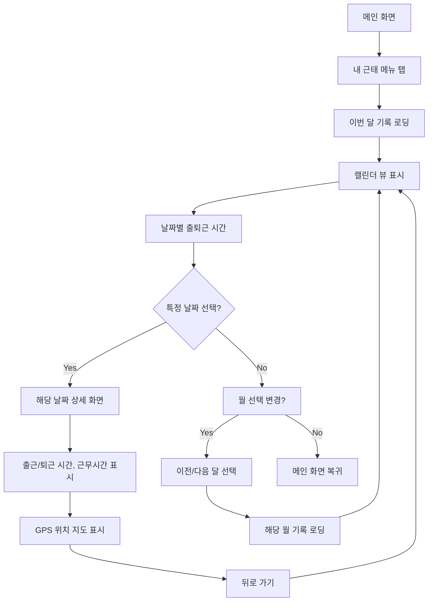

**상세 설명:**

1. **캘린더 뷰**
   - 월간 캘린더 형식
   - 출근 날짜는 초록색 점 표시
   - 결근 날짜는 빨간색 점 표시

2. **상세 화면**
   - 출근/퇴근 정확한 시간
   - 총 근무 시간
   - GPS 위치 지도 표시 (작은 맵)

3. **월 통계**
   - 총 출근 일수
   - 총 근무 시간
   - (향후) 예상 급여

---

## 3. 관리자 User Flow

### 3.1 로그인 및 대시보드

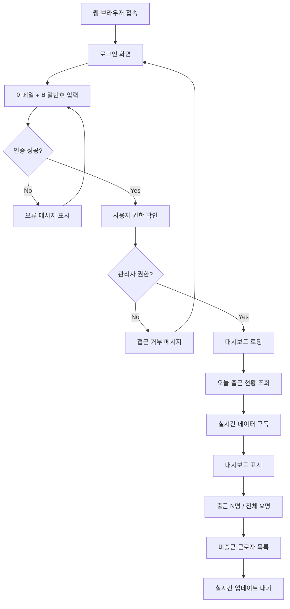

**상세 설명:**

1. **로그인 화면**
   - 이메일 입력
   - 비밀번호 입력 (마스킹)
   - "로그인 유지" 체크박스

2. **권한 확인**
   - DB에서 role = 'manager' 확인
   - 사업장 정보 로딩
   - 근로자 목록 캐싱

3. **대시보드 레이아웃**
   - 상단: 오늘 날짜, 사업장명
   - 중앙: 큰 숫자 (출근 현황)
   - 하단: 미출근 목록 테이블

---

### 3.2 실시간 출퇴근 모니터링

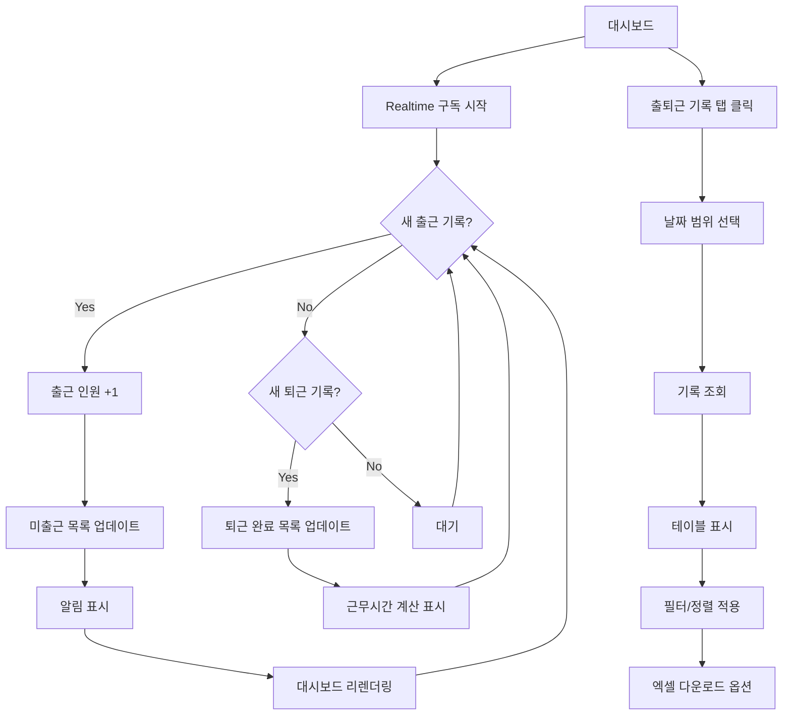

**상세 설명:**

1. **실시간 업데이트**
   - Supabase Realtime 사용
   - attendances 테이블 변경 감지
   - 자동 UI 업데이트 (새로고침 불필요)

2. **출근 현황 카드**
   - 출근 완료 (초록색)
   - 근무 중 (파란색)
   - 퇴근 완료 (회색)
   - 미출근 (빨간색)

3. **상세 기록 테이블**
   - 컬럼: 이름, 파트, 출근시간, 퇴근시간, 근무시간
   - 정렬: 이름순, 시간순
   - 필터: 파트별, 상태별

---

### 3.3 근로자 관리

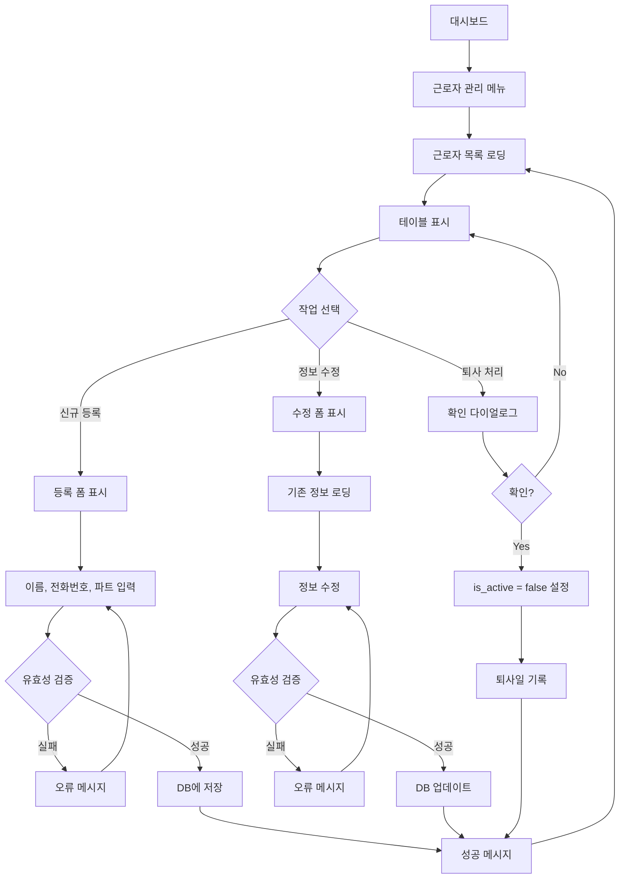

**상세 설명:**

1. **근로자 목록**
   - 검색: 이름, 전화번호
   - 필터: 파트별, 재직/퇴사
   - 정렬: 이름순, 입사일순

2. **등록 폼**
   - 이름 (한글, 2-10자)
   - 전화번호 (하이픈 자동, 중복 체크)
   - 파트 선택 (드롭다운)

3. **유효성 검증**
   - 전화번호 형식 (010-XXXX-XXXX)
   - 전화번호 중복 체크
   - 파트 선택 필수

---

### 3.4 급여대장 생성 및 내보내기

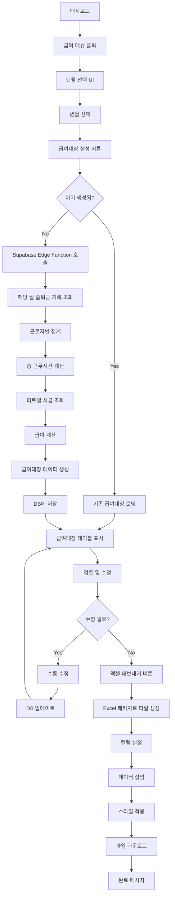

**상세 설명:**

1. **년월 선택**
   - 월 선택기 (드롭다운)
   - 기본값: 이전 달
   - 미래 월 선택 불가

2. **급여 계산 로직**
   ```
   FOR EACH 근로자:
     총 근무시간 = SUM(퇴근시간 - 출근시간)
     파트 조회 → 시급
     기본급 = 시급 × 총 근무시간
   ```

3. **급여대장 테이블**
   - 컬럼: 이름, 파트, 출근일수, 총 근무시간, 기본급
   - 합계 행 추가
   - 정렬: 이름순

4. **엑셀 내보내기**
   - 파일명: `급여대장_YYYY-MM_사업장명.xlsx`
   - 시트명: "급여대장"
   - 헤더 볼드 처리
   - 금액 천 단위 콤마

---

## 4. 시스템 통합 Flow

### 4.1 전체 데이터 흐름

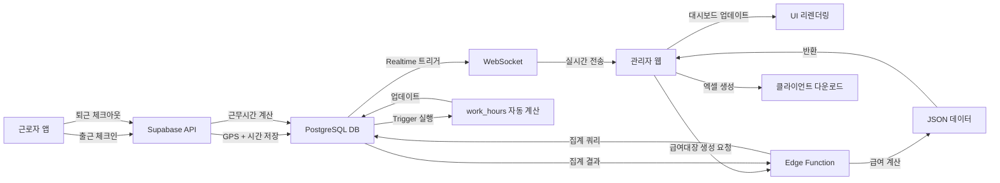

---

### 4.2 GPS 검증 Flow

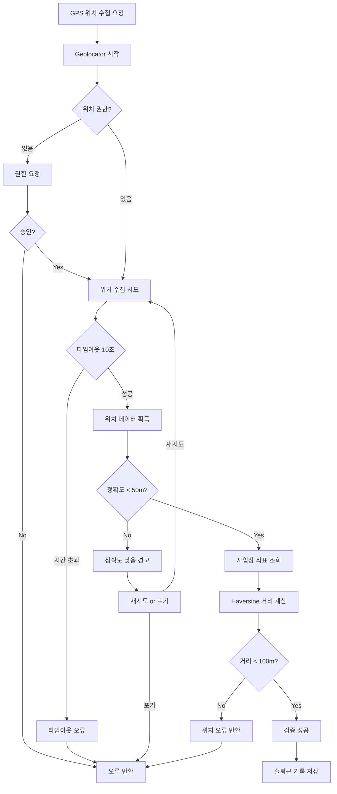

---

## 5. 예외 상황 Flow

### 5.1 네트워크 오류 처리

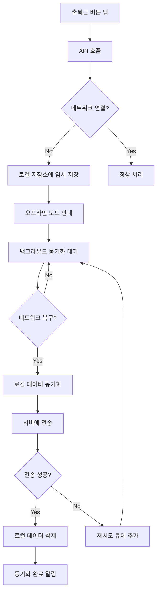

**상세 설명:**

1. **로컬 저장**
   - SharedPreferences 사용
   - 최대 10개 기록 보관
   - 타임스탬프 포함

2. **백그라운드 동기화**
   - ConnectivityPlus 패키지로 네트워크 감지
   - 자동 재시도 (1분, 5분, 10분 간격)
   - 최대 3회 시도

3. **사용자 안내**
   - "오프라인 모드입니다. 출퇴근 기록이 임시 저장되었습니다."
   - "네트워크 연결 시 자동으로 동기화됩니다."

---

### 5.2 GPS 오류 처리

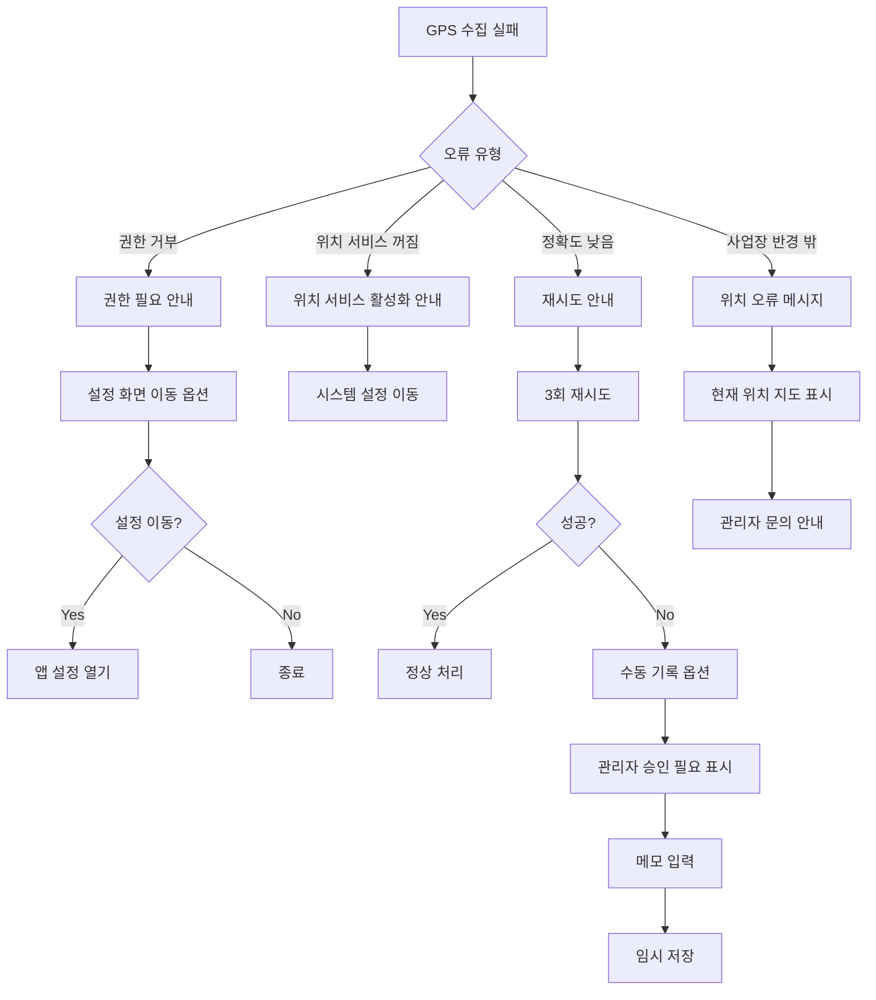

---

### 5.3 중복 체크인 방지

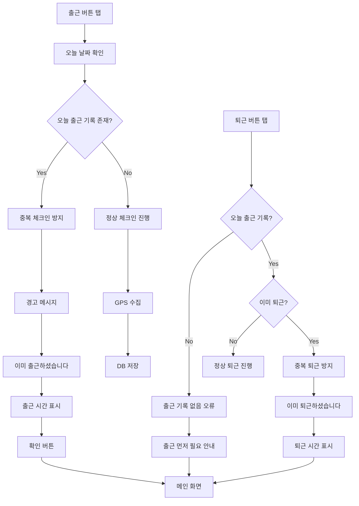

---

### 5.4 관리자 승인 Flow (Post-MVP)

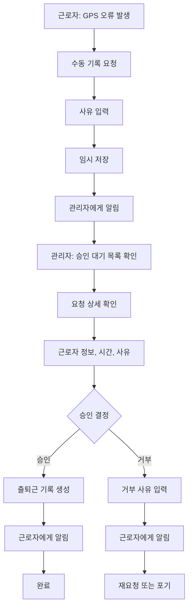

---

## 부록

### A. 화면 전환 매트릭스

| 현재 화면 | 액션 | 다음 화면 |
|---------|-----|---------|
| 스플래시 | 자동 (1초) | 로그인 or 메인 |
| 로그인 | 인증 성공 | 메인 |
| 메인 | 출근 버튼 | 출근 중 |
| 출근 중 | 퇴근 버튼 | 퇴근 완료 |
| 퇴근 완료 | 확인 버튼 | 메인 |
| 메인 | 내 근태 메뉴 | 근태 기록 |
| 근태 기록 | 뒤로 가기 | 메인 |

### B. 에러 메시지 가이드

| 에러 코드 | 메시지 | 액션 |
|---------|-------|------|
| GPS_PERMISSION_DENIED | "위치 권한이 필요합니다" | 설정 이동 |
| GPS_TIMEOUT | "위치를 찾을 수 없습니다" | 재시도 |
| GPS_LOW_ACCURACY | "GPS 정확도가 낮습니다" | 재시도 or 수동 |
| OUT_OF_RANGE | "사업장 반경을 벗어났습니다" | 위치 확인 |
| NETWORK_ERROR | "네트워크 연결을 확인하세요" | 재시도 |
| ALREADY_CHECKED_IN | "이미 출근하셨습니다" | 확인 |
| NO_CHECK_IN_RECORD | "출근 기록이 없습니다" | 관리자 문의 |

### C. 성능 목표

| Flow | 단계 | 목표 시간 |
|-----|-----|---------|
| 출근 체크인 | 버튼 탭 → 완료 | < 2초 |
| 퇴근 체크아웃 | 버튼 탭 → 완료 | < 2초 |
| 대시보드 로딩 | 로그인 → 표시 | < 3초 |
| 급여대장 생성 | 요청 → 표시 | < 5초 (50명 기준) |
| 엑셀 다운로드 | 버튼 → 파일 | < 3초 |

---

**문서 승인:**
- [ ] UX Designer
- [ ] Frontend Developer
- [ ] Product Manager

**변경 이력:**
| 버전 | 날짜 | 작성자 | 변경 내용 |
|-----|-----|-------|---------|
| 1.0 | 2026-02-02 | UX Team | 초안 작성 |
